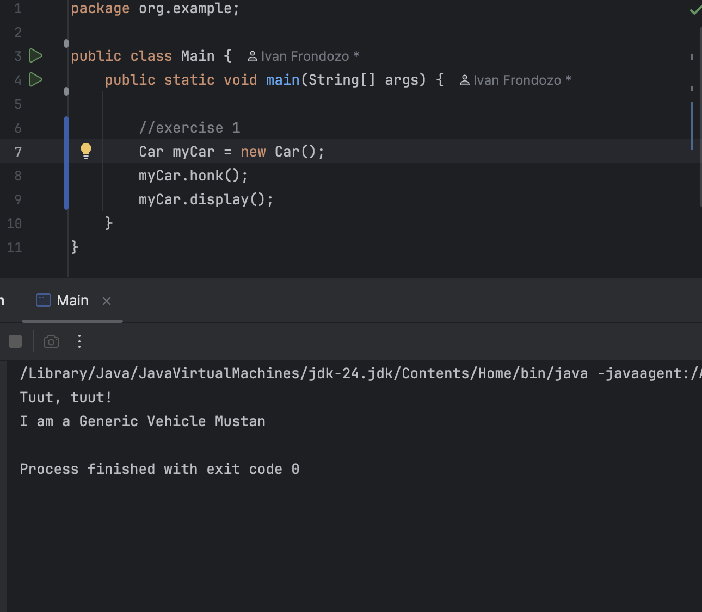
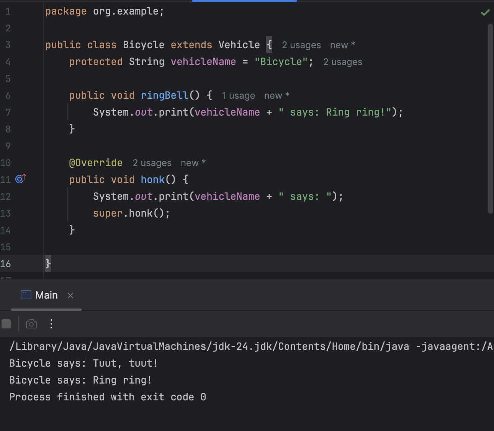
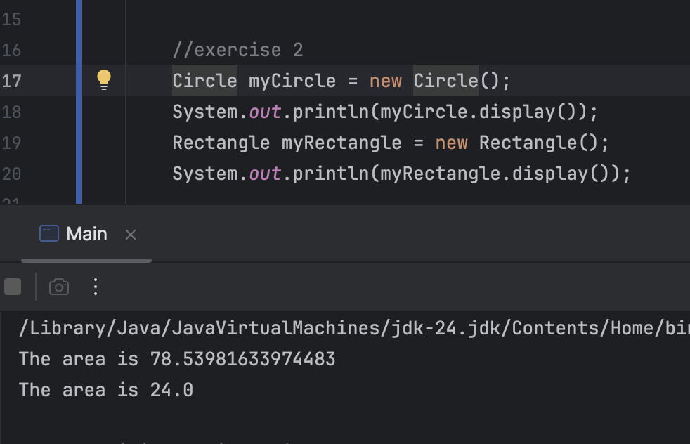
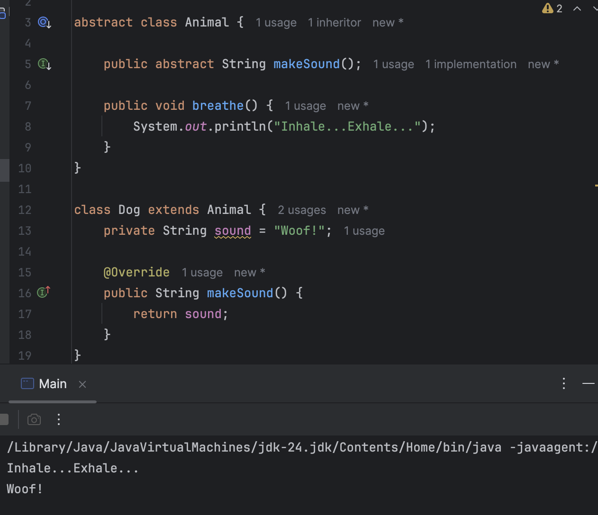
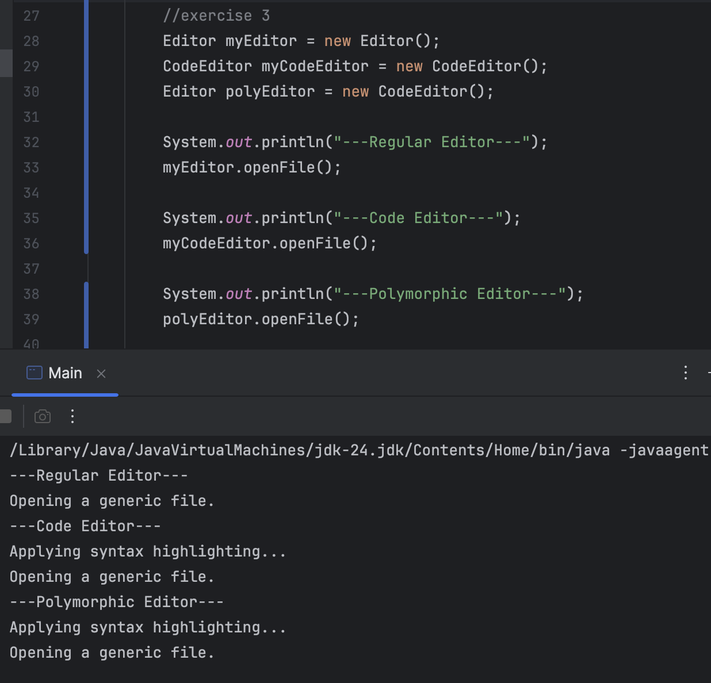
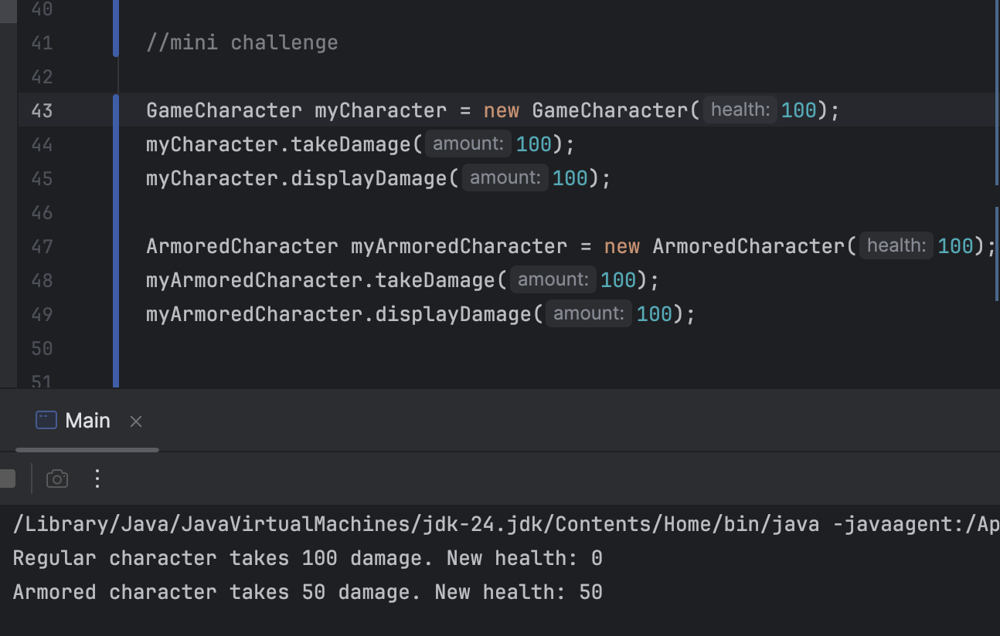
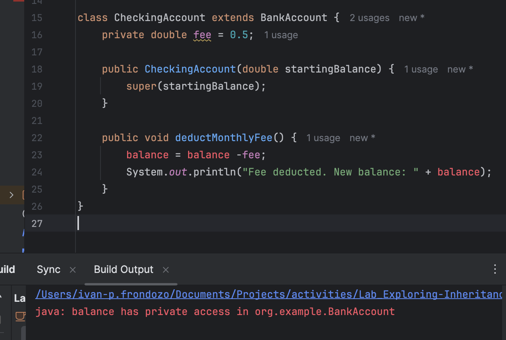
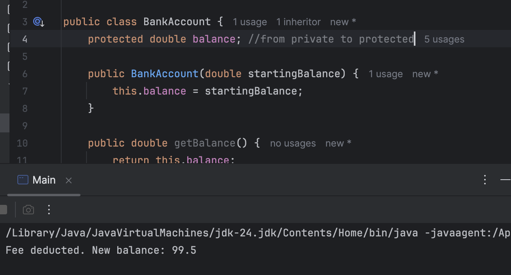
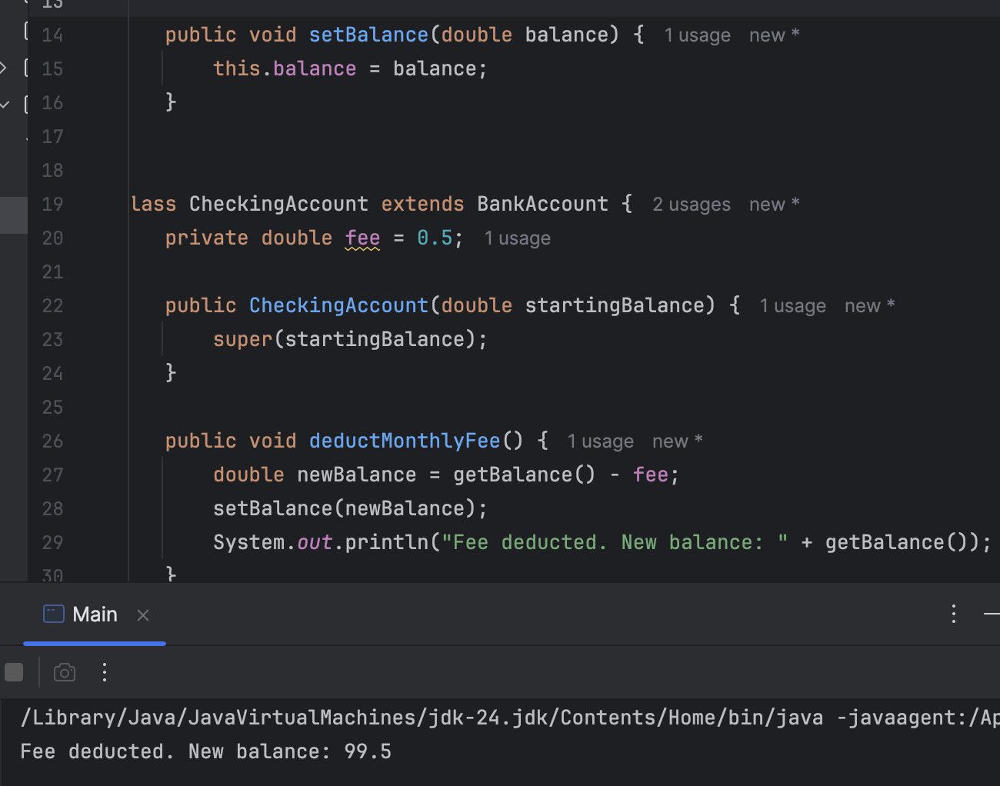

# Lab: Exploring Inheritance and Method Override

### by: Ivan Frondozo

## Description

This simple Java program explores how to work with Inheritance and Method Overriding through exercises and mini challenges.

## Output

### Exercise 1: Basic Inheritance - The extends keyword

### Mini challenge 1

### Exercise 2: Abstract Classes - Defining a Template

### Mini challenge 2

### Exercise 3: Method Overriding: - Providing a New Implementation

### Mini challenge 3

### Exercise 4: Inheriting Variables & Access Rules

### Mini challenge 4: Fix the Code - Using protected modifier

### Mini challenge 4: Fix the Code - Using public setters

